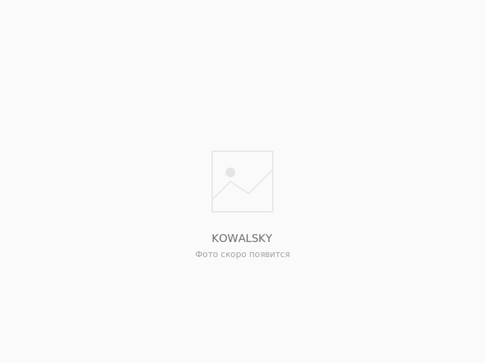

# ✨ Обновление v2.2 - Полный каталог с placeholder

**Дата:** 30 октября 2025  
**Тип:** Расширение каталога

---

## 🎯 Что добавлено:

### Все товары теперь в каталоге!

Вместо секции "Дополнительно" все товары стали полноценными карточками с описаниями и ценами.

**Всего товаров в каталоге:** 15 позиций

---

## 📦 Добавленные товары:

### Луч / Laser / ILCA (7 товаров):
1. ✅ Чехол для яхты Луч — 7,500₽ (с фото)
2. ✅ Удлинитель румпеля 100 см — 4,500₽ (с фото)
3. ✅ Откреночный ремень для Луч — 2,500₽ (с фото)
4. 🆕 **Телега для берега** — Уточняйте (placeholder)
5. 🆕 **Конструкция на 8 лодок** — Уточняйте (placeholder)
6. 🆕 **Парус тренировочный** — Уточняйте (placeholder)
7. 🆕 **Шкот 13м** — Уточняйте (placeholder)

### Ракета 270 (2 товара):
1. ✅ Чехол для Ракета 270 — 5,900₽ (с фото)
2. 🆕 **Откреночный ремень** — 2,500₽ (placeholder)

### Оптимист (1 товар):
1. ✅ Чехол для Оптимист — Предзаказ (с фото)

### Аксессуары (4 товара):
1. 🆕 **Флюгарка** — Уточняйте (placeholder)
2. 🆕 **Кепка KOWALSKY** — Уточняйте (placeholder)
3. 🆕 **Очки для яхтинга** — Уточняйте (placeholder)
4. 🆕 **Перчатки для яхтинга** — Уточняйте (placeholder)

### Причал (1 товар):
1. ✅ Сервисная колонка — 75,000₽ (с фото)

---

## 🖼️ Placeholder изображение:

Создано профессиональное SVG-изображение `placeholder.svg`:

**Дизайн:**
- Минималистичная иконка изображения
- Текст "KOWALSKY"
- Подпись "Фото скоро появится"
- Цветовая схема в стиле сайта (#FAFAFA, #E5E5E5, #6B6B6B)
- Размер: 800×600px (соотношение 4:3)

**Преимущества:**
✅ Легковесный файл (SVG)
✅ Идеально масштабируется
✅ Соответствует дизайну сайта
✅ Профессиональный вид

---

## 📝 Описания товаров:

Для каждого нового товара добавлено:
- Полное название
- Подробное описание
- Цена (или "Уточняйте")
- Кнопка "Заказать"

### Примеры описаний:

**Телега для берега:**
> Удобная транспортировка яхты от хранилища до воды. Прочная конструкция для Луч, Laser, ILCA

**Флюгарка:**
> Индикатор направления ветра для яхтсменов. Легкая и чувствительная конструкция

**Перчатки для яхтинга:**
> Специальные перчатки для работы со шкотами. Защита от мозолей и надежный хват

---

## 🔄 Изменения в структуре:

### До обновления:
```
Каталог:
├─ 6 товаров с фото
└─ Секция "Дополнительно" (9 позиций списком)
```

### После обновления:
```
Каталог:
├─ 6 товаров с реальными фото
├─ 9 товаров с placeholder
└─ (секция "Дополнительно" удалена)
```

---

## 💰 Ценообразование:

**Товары с фиксированной ценой:**
- Чехлы: 2,500₽ - 7,500₽
- Удлинители: 4,500₽
- Ремни: 2,500₽
- Сервисная колонка: 75,000₽

**Товары "Уточняйте":**
- Телега для берега
- Конструкция на 8 лодок
- Парус тренировочный
- Шкот 13м
- Флюгарка
- Кепка
- Очки
- Перчатки

---

## 🎨 Визуальные улучшения:

### Единообразие:
✅ Все товары в одном формате  
✅ Одинаковые карточки  
✅ Одинаковая структура  

### Профессиональный вид:
✅ Placeholder не выглядит как "нет фото"  
✅ Брендированное изображение  
✅ Минималистичный стиль  

### UX:
✅ Все товары кликабельны  
✅ Кнопка "Заказать" у каждого  
✅ Понятные описания  
✅ Работают фильтры  

---

## 📊 Статистика по фильтрам:

Теперь каждый фильтр показывает:

| Фильтр | Товаров |
|--------|---------|
| **Все** | 15 |
| **Луч** | 7 |
| **Ракета 270** | 2 |
| **Оптимист** | 1 |
| **Аксессуары** | 4 |
| **Причал** | 1 |

---

## 🔄 Как заменить placeholder на реальное фото:

### Когда у вас появится фотография:

1. Добавьте фото в папку проекта
2. Откройте `index.html`
3. Найдите нужный товар
4. Замените:

```html
<!-- Было -->


<!-- Станет -->

```

### Для добавления галереи:

```html
<div class="product-gallery">
    
    <div class="product-thumbnails">
        
        
        
    </div>
</div>
```

---

## 📝 Редактирование цен:

### Изменить "Уточняйте" на конкретную цену:

**Файл:** `index.html`

```html
<!-- Было -->
<span class="price">Уточняйте</span>

<!-- Станет -->
<span class="price">5 000 ₽</span>
```

---

## 🎯 Преимущества полного каталога:

### Для покупателей:
✅ Видят все товары сразу  
✅ Могут фильтровать по категориям  
✅ Понимают ассортимент  
✅ Читают описания  
✅ Могут заказать любой товар  

### Для SEO:
✅ Больше контента на странице  
✅ Ключевые слова в описаниях  
✅ Больше страниц для индексации  
✅ Лучше для поисковиков  

### Для продаж:
✅ Все товары "в одном месте"  
✅ Проще объяснить ассортимент  
✅ Клиенты видят полную картину  
✅ Удобно делать кросс-продажи  

---

## 💡 Рекомендации:

### В ближайшее время:
1. **Добавьте цены** на товары "Уточняйте"
2. **Сфотографируйте товары** и замените placeholder
3. **Дополните описания** если нужно

### В перспективе:
1. Добавьте характеристики (размеры, вес, материал)
2. Создайте комплекты товаров со скидкой
3. Добавьте отзывы на популярные товары
4. Сделайте сравнение похожих товаров

---

## 🆕 Новые файлы:

- ✅ `placeholder.svg` - дефолтное изображение для товаров

---

## 📱 Мобильная версия:

Все новые товары адаптивны:
- ✅ Карточки товаров подстраиваются под экран
- ✅ Placeholder корректно отображается
- ✅ Описания читаемы
- ✅ Кнопки удобно нажимать

---

## 🎉 Результат:

Теперь у вас **полноценный интернет-магазин** с 15 товарами!

**Было:**
- 6 товаров с фото
- 9 пунктов списком

**Стало:**
- 15 товаров с карточками
- Все с описаниями
- Все с кнопкой заказа
- Все фильтруются

---

## 🔍 Что дальше:

### Готово к запуску:
- [x] Все товары добавлены
- [x] Описания написаны
- [x] Placeholder созданы
- [x] Структура работает

### Нужно сделать:
- [ ] Добавить реальные фотографии (по мере появления)
- [ ] Установить точные цены
- [ ] Опубликовать сайт
- [ ] Начать принимать заказы

---

**Версия:** 2.2  
**Предыдущая версия:** 2.1 (Группировка по классам)  
**Следующее обновление:** Когда появятся фотографии

---

*Создано 30 октября 2025*

